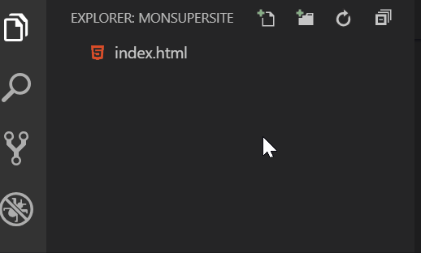
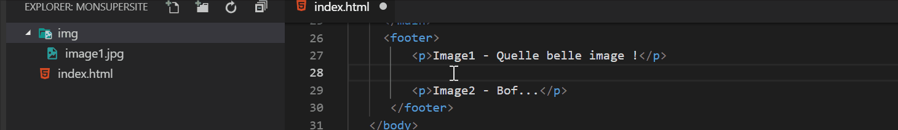

> *Prérequis* : Avoir lu la partie 1

## Ajouter une image

Il y a en gros deux façons d'ajouter une image: soit à partir d'un fichier, soit à partir d'un lien.

### Image à partir d'un lien

On peut chercher des images d'un peu tout et n'importe quoi sur Google.

Pour l'exemple cherchons une image de chat rigolo. 

> **Important:** Si c'est pour un site qui a vocation à être publié, il faut faire très très très très attention aux droits d'auteur !!! 


Quand vous trouvez une image qui vous intéresse, il vous suffit de copier l'adresse de l'image avec un clic-droit, puis:

```html 

```

Dans le fichier complet, ça donne:

```html
<!DOCTYPE html>
<html>
   <head>
      <meta charset="UTF-8">
      <title>Notre première page Web</title>
   </head>
   <body>
      <header>
         <h1>Le monde de Gerflor</h1>
      </header>
     <nav>
         <ul>
            <li>Accueil</li>
            <li>Contact</li>
         </ul>
     </nav>
     <main>
         <p>Mon voyage dans la Beauce</p>
         <p>Le meilleur camping du Havre</p>
         <p>Une photo d'un chat rigolo 
       </p>
         <p>La vie des cailloux en milieu aquatique</p>
     </main>
     <footer>
         <p>Image1 - Quelle belle image !</p>
         <p>Image2 - Bof...</p>
      </footer>
   </body>
</html>
```

Cette méthode est valable si vous avez des images stockées dans le cloud, comme avec Google Drive, Dropbox, Onedrive ou autre.

Au passage: vous pouvez essayer le site [cloudinary](https://cloudinary.com/) qui permet le partage avancé de photos.

### Image à partir d'un fichier

Nous devons en premier créer un sous-dossier, par exemple `img`, dans lequel nous allons stocker nos images.




Pour simplifier, nous allons mettre une image dans ce dossier que nous allons renommer `image1.jpg`

Pour l'insérer dans notre site:

```html

```

> Pratique: l'auto-complétion des chemins pour insérer une image par exemple:




> `./img/image1.jpg` est un chemin **relatif**. Tous les chemins doivent être relatifs, pas *absolus*.
Il faut de plus respecter la *casse*, c'est-à-dire les majuscules et les minuscules.


Vous pouvez mettre cette image à l'endroit que vous souhaitez. Faites plusieurs essais 😸

